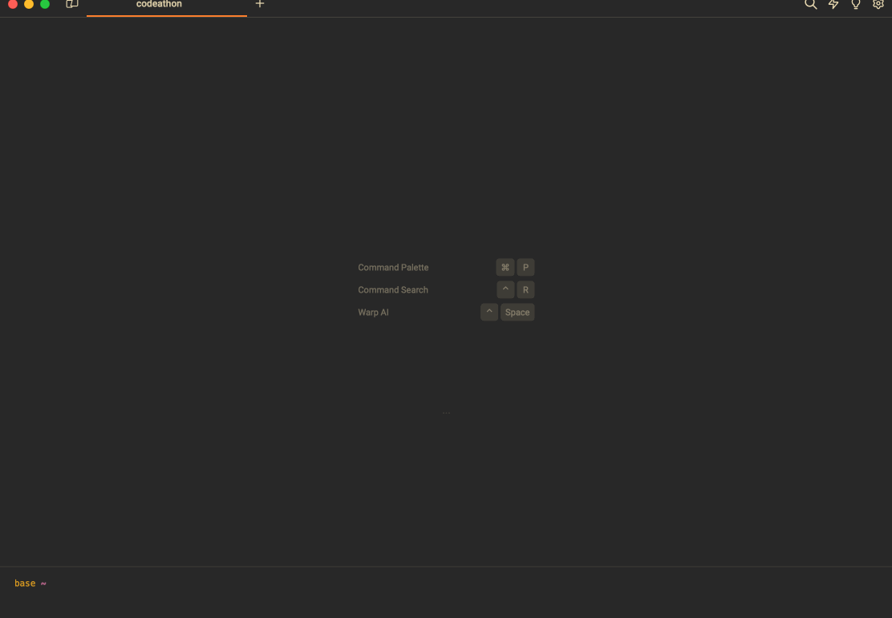

# ClinCluster: A Package for Aggregating Disease Terms in ClinVar

List of participants and affiliations:
- Melissa Landrum, NIH/NCBI (Co-Team Leader)
- Guangfeng Song, NIH/NCBI (Co-Team Leader)
- Lauren Edgar, NIH/NHGRI
- Benjamin Kesler, Vanderbilt University
- Nicholas Minor, University of Wisconsin
- Michael Muchow, Unaffiliated
- Rebecca Orris, NIH/NCBI
- Wengang Zhang, NIH/NCI

## Project Goals
Naming for human genetic diseases is complex. Diseases may be named for the phenotype; other information may be alluded to including the relevant gene, mode of inheritance, or the mechanism of disease. Diseases may be described at a high level with a generic name, or at a lower level with a more specific name; however, in the context of a variant in a specific gene, these differences may not be considered important. ClinVar data would be easier to ingest in bulk and to read in web displays if there were a meaningful way to aggregate diseases that effectively mean the same thing in the context of a gene.

* Problem Statement: Diseases in ClinVar are very granular and result in many variant-disease records.

* Can we use an ML/AI approach to aggregate disease terms in ClinVar to reduce the number of variant-disease records?

Example of granularity for Familial Hypercholesterolemia
## Approach
Develop a ML/AI approach to aggregating diseases for 5 genes with variants in ClinVar: LDLR, KCNQ1, USH2A, SCN5A, TSC1.

* Use the gene symbol to guide whether different terms are meaningfully different for that gene, e.g. Familial hypercholesterolemia vs Hypercholesterolemia, familial, 1

* Use other information such as mode of inheritance, clinical features, and mechanism of disease to decide if terms should be aggregated or not

* Demonstrate how RCV records for variant-condition pairs in ClinVar for one or more genes would be different using aggregated diseases.

### Aggregating the disease terms
1. Extract disease names from all RCV records associated with a single gene
  1. Extract all unique MedGen ID and their disease names

2. Cluster the name into their umbrella disease category
  1. Program LLM to cluster the disease terms
  2. Fork https://github.com/simonw/llm-cluster/blob/main/llm_cluster.py

3. Identify variant records with similar disease names that belong to the same umbrella diseases

4. Assign those RCV records with the corrected (umbrella) name

## Results

## Demo

## Future Work
* Evaluate and test other LLMs with more training in biomedical knowledge to reduce the amount of curation needed

* Generate a test set of ClinVar data using aggregated disease terms

* Review test data set with ClinVar users to determine the value added and areas to improve

## Common Acronyms
Abbreviation  | Acronym
------------- | -------------
ACMG  | American College of Medical Genetics and Genomics
DBSCAN  | Density-Based Spatial Clustering of Applications with Noise
GPT  | Generative Pre-trained Transformer
HGNC  | HUGO Gene Nomenclature Committee
HGVS  |	Human Genome Variation Society
HI  |	Haploinsufficiency
HUGO  |	Human Genome Organization
LLM  |	Large Language Model
MeSH  |	Medical Subject Headings
NGS  | Next-Generation Sequencing
NLP  | Natural Language Processing
OMIM  |	Online Mendelian Inheritance in Man
PMC  | PubMed Central
RCV  |	Reference (variant-condition) ClinVar Variant Accession Identifier
SCV  |	Submitted ClinVar Variant Accession Identifier
SNP  |	Single-Nucleotide Polymorphism
SRA  |	Sequence Read Archive
TS  |	Triplosensitivity
VUS  |	Variant of Uncertain Significance
VCV  |	Variant ClinVar Variant Accession Identifier

## NCBI Codeathon Disclaimer
This software was created as part of an NCBI codeathon, a hackathon-style event focused on rapid innovation. While we encourage you to explore and adapt this code, please be aware that NCBI does not provide ongoing support for it.

For general questions about NCBI software and tools, please visit: [NCBI Contact Page](https://www.ncbi.nlm.nih.gov/home/about/contact/)
